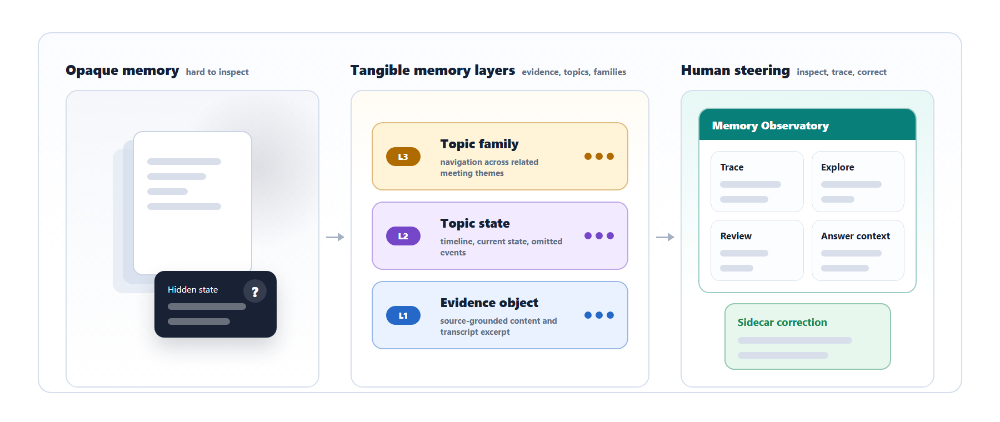
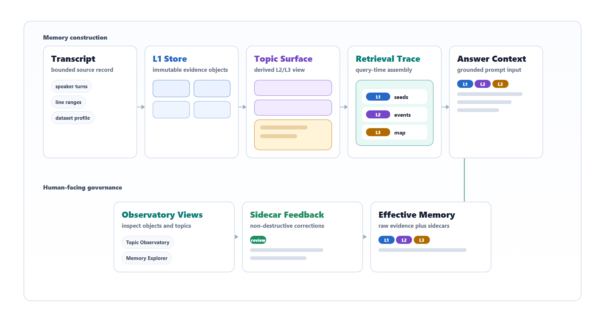
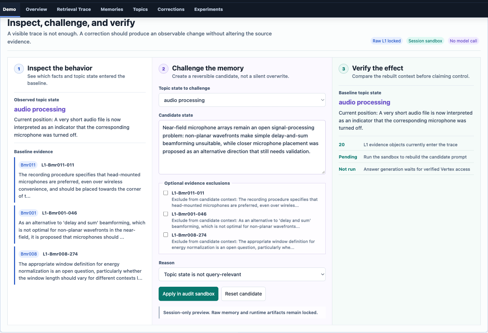

# Tangible Mem

**Inspectable and Correctable Hierarchical Memory for Long-Term Research Meetings**

Shang-Jung Tsai · Yu-Jen Chen · Yi-Hsin Lee<br>
Advisor: Yu-Chun Yen<br>
National Yang Ming Chiao Tung University

[Project Page](https://shangjung1012.github.io/Tangible-Mem/) ·
[Code](https://github.com/shangjung1012/Tangible-Mem) ·
[Poster](site/static/pdfs/tangible-mem-poster.pdf) ·
[Slides](site/static/pdfs/tangible-mem-slides.pdf)



## Overview

Research decisions, rationales, and open questions evolve across meetings, but
many AI assistants reduce that history to a short chat window or an opaque set
of retrieved chunks. Tangible Mem is a hierarchical memory system and
inspection workbench for long-term research meetings. It keeps source-grounded
evidence separate from generated topic structure, exposes the retrieval path,
and lets people record corrections without overwriting raw evidence.

The current research prototype consists of the layered memory pipeline and
**Memory Observatory**, a FastAPI-based interface for inspecting memory objects,
topic evolution, retrieval traces, comparison artifacts, and sidecar feedback.
The public [project page](https://shangjung1012.github.io/Tangible-Mem/) is a
static overview; it does not simulate the application backend.

## Memory Architecture

| Layer | Role | Evidence status |
| --- | --- | --- |
| **L1 — Evidence objects** | Source-grounded meeting memories with transcript evidence and provenance. | Immutable source layer |
| **L2 — Topic states** | Persistent summaries and selected event timelines across meetings. | Derived context |
| **L3 — Topic families** | Higher-level navigation across related topic states. | Navigation, not evidence |
| **Sidecar correction** | Human review of importance, validity, summaries, and topic links. | Non-destructive control |

Retrieval starts from L1 evidence, expands into selected L2 evolution context,
and uses L3 only for broader navigation. Generated views and feedback remain
sidecars so that the source evidence can always be recovered and audited.



## Memory Observatory

Memory Observatory provides four inspection surfaces:

- **Closed-loop memory audit** — inspect a behavior, challenge the effective
  memory, and verify how the rebuilt context changes.
- **Retrieval Trace** — see which L1 evidence and L2/L3 context enter a prompt.
- **Memory Explorer** — move from meetings to memory objects and their source
  evidence.
- **Topic Observatory** — inspect topic states, topic families, timelines, and
  linked evidence.

[](https://shangjung1012.github.io/Tangible-Mem/#observatory)

The screenshot uses the public ICSI meeting corpus and committed read-only
artifacts. The GitHub Page does not publish raw private meeting content or
credentials.

## Preliminary Evaluation

The following evaluations answer different questions and must not be combined
as one result.

### Internal answer-quality evaluation

Fourteen internal research-meeting questions were answered and judged with
Gemini 2.5 Pro. Full Context is an uncapped upper-bound condition.

| Method | Final quality (/5) | Avg. total tokens |
| --- | ---: | ---: |
| Full Context | 4.894 | 81,069 |
| RAG Baseline | 4.507 | 21,284 |
| **Layered Memory** | **4.789** | **14,115** |

Layered Memory scored below uncapped Full Context and above the tested RAG
baseline while using substantially fewer total tokens. This preliminary result
does not establish general superiority.

### ICSI retrieval and evidence diagnostic

Twenty held-out ICSI questions were evaluated without answer generation or an
answer-quality judge.

| Method | Expected L1 recall | Avg. context tokens |
| --- | ---: | ---: |
| Full Context L1 | 1.0000 | 575,199 |
| Lexical RAG | 0.5583 | 2,370 |
| **Layered Memory** | **0.8958** | **7,358** |

The layered configuration recovered more expected source evidence than top-20
lexical RAG at a larger—but still far smaller than full-context—context budget.
This diagnostic does not measure generated-answer quality.

Sources: [final experiment report](memory_observatory/runs/experiment_final/README.md),
[ICSI system comparison](optimization/reports/icsi_bmr_full_completed29_system_comparison_revised_20260614/system_comparison_summary.md),
and [claim boundary](doc/taichi/claim_boundary_and_evaluation_update.md).

> **Claim boundary:** these artifacts support a technical system demonstration
> and preliminary diagnostics. No completed user study is reported, and the
> results do not establish user trust, usability gains, state-of-the-art
> retrieval, or generated-answer superiority on ICSI.

## Quick Start

### Requirements

- Python 3.12
- [`uv`](https://docs.astral.sh/uv/)
- Google Cloud or Gemini credentials only when using model-backed features

```bash
git clone https://github.com/shangjung1012/Tangible-Mem.git
cd Tangible-Mem
uv sync
cp .env.example .env
```

Configure `.env` for the model-backed paths you intend to use. Never commit
credentials or a populated `.env` file.

### Run Memory Observatory

```bash
uv run uvicorn memory_observatory.main:app --reload
```

Open `http://localhost:8000/` and select the ICSI dataset for the committed
artifact-backed walkthrough.

Run the read-only demo readiness check with:

```bash
uv run python memory_observatory/demo_health_check.py --dataset icsi
```

The separate chat application can be started with:

```bash
uv run app/main.py
```

## Repository Guide

| Path | Responsibility |
| --- | --- |
| `share_mem/` | Canonical L1 evidence store and extraction pipeline |
| `long_term/` | Canonical generated L2/L3 views and validation tooling |
| `optimization/long_term_v2/` | Sidecar-first L2/L3 pipeline for new datasets |
| `memory_observatory/` | Inspection UI, retrieval trace, feedback, and experiment tooling |
| `app/` | Chat application, memory routing, and context assembly |
| `site/` | Static academic project page deployed through GitHub Pages |

Detailed documentation:

- [Architecture and update/retrieval flow](doc/l1_l2_update_retrieve_flow.md)
- [Repository folder responsibilities](doc/project_folder_map.md)
- [Memory Observatory guide](memory_observatory/README.md)
- [Optimization v2 guide](optimization/README.md)
- [L1 evidence store](share_mem/README.md)
- [Canonical long-term memory](long_term/README.md)

## Data Safety and Current Limitations

- Do not manually edit `share_mem/tree.json` or `share_mem/meetings/*`; raw L1
  evidence is immutable.
- Keep generated L2/L3 views, review feedback, and correction signals in their
  designated derived views or sidecars.
- Do not overwrite canonical `long_term/l2` or `long_term/l3` with optimization
  outputs.
- Do not commit `.env`, credentials, large raw run folders, or private meeting
  material.
- Generated L2/L3 topic structures remain imperfect and reviewable.
- A human-subject study has not yet been completed.
